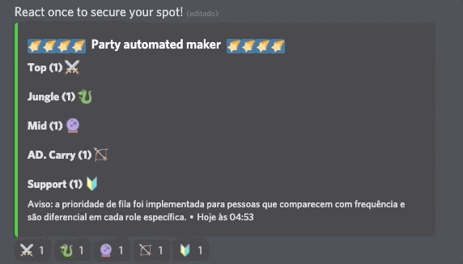

<h1 align="center">⭐ Automated Group Maker ⭐</h1>

Bot para criar grupos de forma iterativa no discord.

  
  

<h2>Demo</h2>

  

<h2>Tecnologias 🛠 </h2>

As seguintes ferramentas foram usadas na construção do projeto:

- [Node.js](https://nodejs.org/en/)
- [Discord.js](https://discord.js.org/#/)

<h2>Install instructions</h2>

Primeiramente, acesse a opção do desenvolvedor do Discord e crie um bot. Você irá precisar do API KEY para continuar.

Abra o arquivo chammado connection.ts e configure a sua conexão com o banco de dados. O modelo do banco de dados confere no arquivo bot.ts na interface schemaModel. 
Feito isso adicione o seu API KEY no campo discordToken e execute o programa.

<h3>Instalação</h3>

yarn start yarn install yarn start

<h4>Getting Started</h4>
<ul>
  <li>1.1) <code>git clone https://github.com/H9Solutions/partymaker</code></li>
  <li>1.2) <code>cd partymaker</code></li>
  <li>1.3) <code>yarn install</code> ou <code>npm install</code></li>
</ul>

<h4>Start your app</h4>
<ul>
  <li>
    Em <code>/connection.ts</code> insira suas configurações de conexão com o banco de dados <code>mysql</code>. 
  </li>
  <li>
    Em <code>/index.ts</code> insira o seu <code>API KEY</code> do bot. <a href="https://discord.com/developers/applications">Acesse aqui para criar um bot</a>
  </li>
  <li>Execute <code>yarn start</code> ou <code>npm start</code> para inicializar o projeto.</li>
</ul>

<h4>Usage</h4>

  Após definir o prefixo, e de ter importado o bot para o seu servidor de discord. Digite <code>!partymaker tag</code> para renderizar o Automatizador de grupos.

